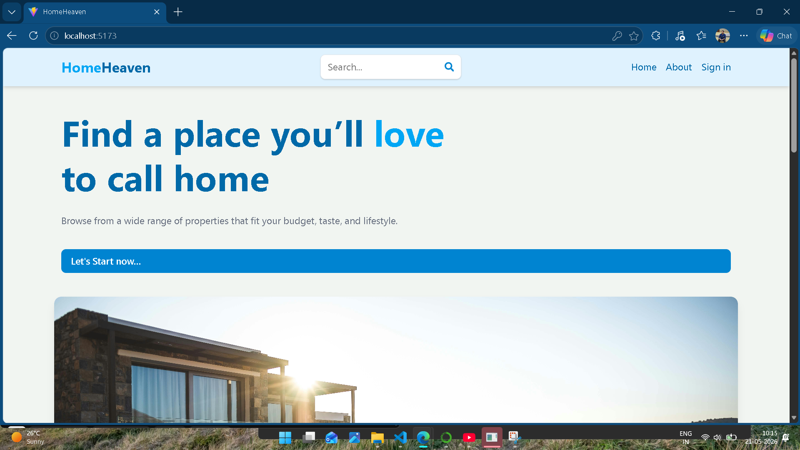
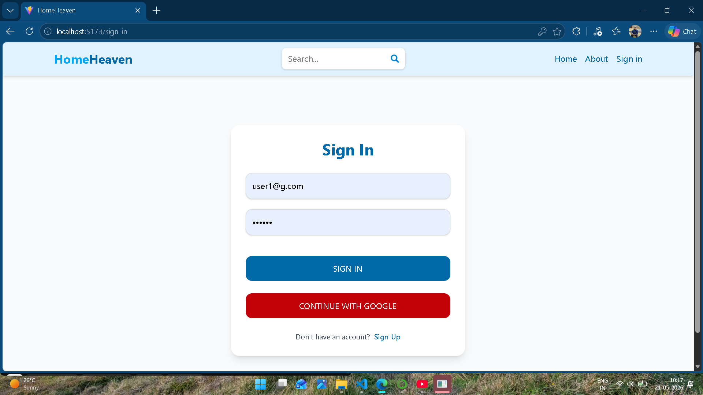
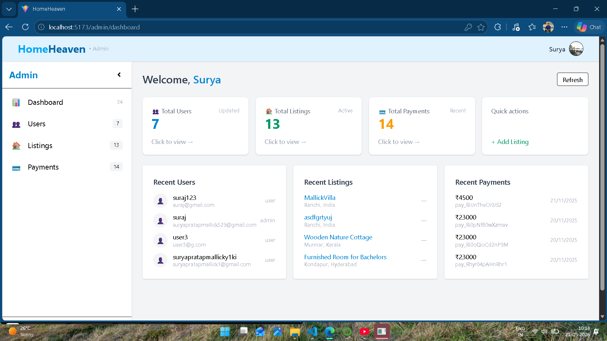
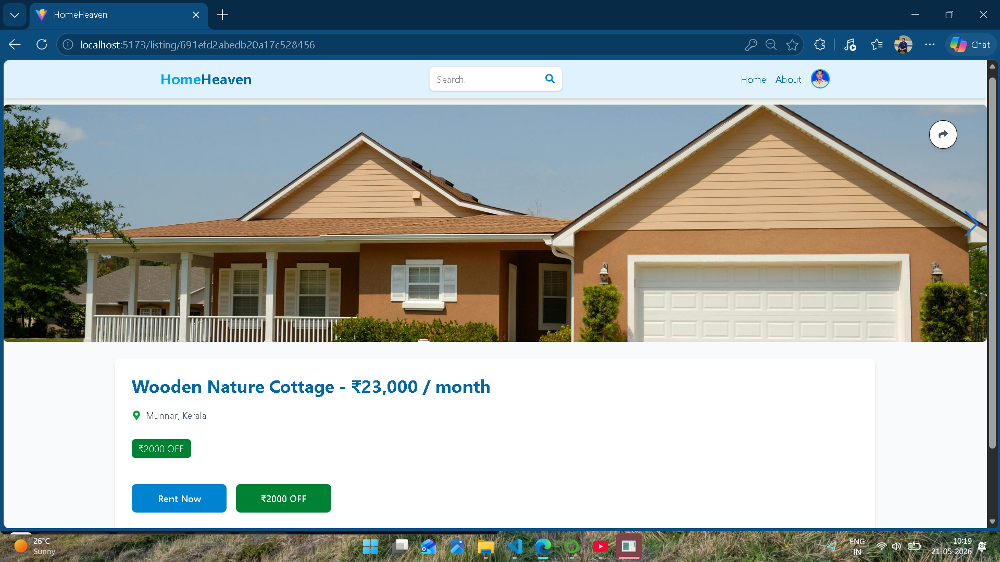
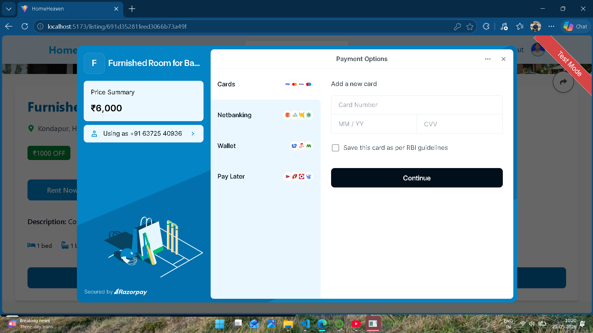
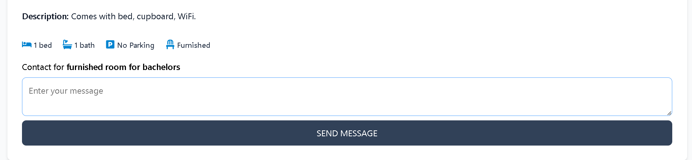
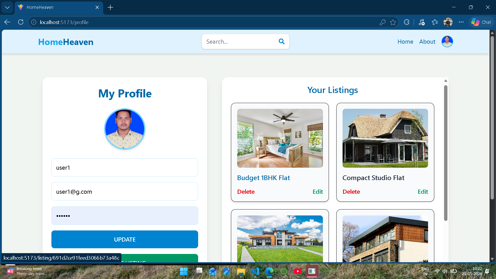
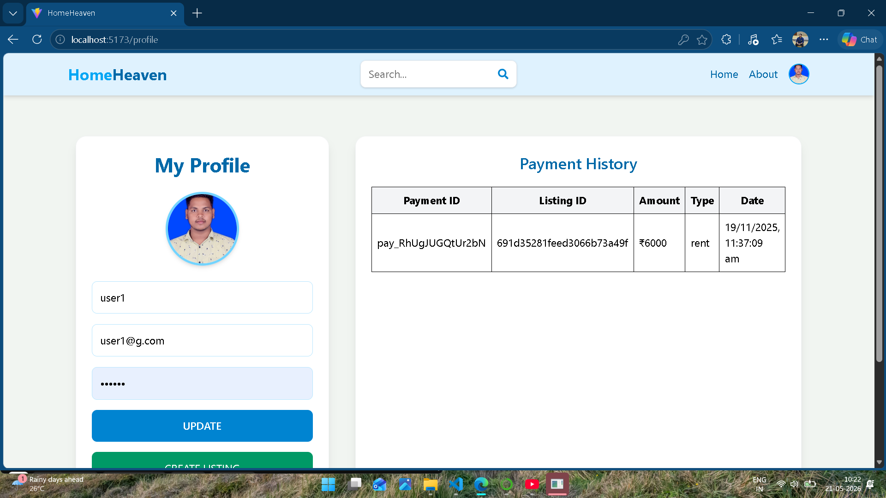

MERN Estate – Full Stack Real Estate Platform

A modern full-stack real estate web application built using the MERN stack. Users can browse property listings, manage accounts, add properties, and perform secure payments.

Features:->
------------
    User Authentication & Authorization
    JWT Based Login System
    Add/Edit/Delete Property Listings
    Responsive UI Design
    Secure Backend APIs
    MongoDB Database Integration
    Payment Integration (Stripe & Razorpay)
    Redux State Management
    Firebase Integration
    Interactive Charts & Dashboard

Tech Stack:->
-------------
Frontend:->
------------
    React.js
    Vite
    Redux Toolkit
    Tailwind CSS
    React Router DOM
    Firebase
Backend:->
----------
    Node.js
    Express.js
    MongoDB
    Mongoose
    JWT Authentication
    Stripe API
    Razorpay API

Folder Structure:->
-------------------
    mern_estate_main/
    │
    ├── api/
    │   ├── controllers/
    │   ├── models/
    │   ├── routes/
    │   └── utils/
    │
    ├── client/
    │   ├── src/
    │   ├── public/
    │   └── components/
    │
    ├── package.json
    └── README.md

Installation:->
---------------
Clone Repository
    -> git clone https://github.com/YOUR_USERNAME/mern-estate.git

Open Project
    -> cd mern-estate

Install Backend Dependencies
    -> npm install

Install Frontend Dependencies
    -> cd client
       npm install

Environment Variables:->
------------------------

Create .env file in root:

    MONGO_URI=your_mongodb_connection
    JWT_SECRET=your_secret_key
    STRIPE_SECRET_KEY=your_key
    RAZORPAY_KEY_ID=your_key
    RAZORPAY_SECRET=your_secret

Create client/.env:->
---------------------

    VITE_FIREBASE_API_KEY=your_key

Run Backend:->
--------------
    -> npm run dev

Run Frontend:->
---------------
    -> cd client
       npm run dev

Future Improvements:->
----------------------
    Admin Dashboard Enhancements
    Advanced Property Filtering
    Booking System
    Real-time Notifications
    AI Based Property Recommendation

    ---

# Project Screenshots

## Home Page

---

## Login Page

---

## Dashboard

---

## Property Page

---

## Payment Page

.

## Contact Section
.

## MY Listings
.

## Payment History
.

Author
------
    Surya Pratap Mallick

    Full Stack Developer (MERN)